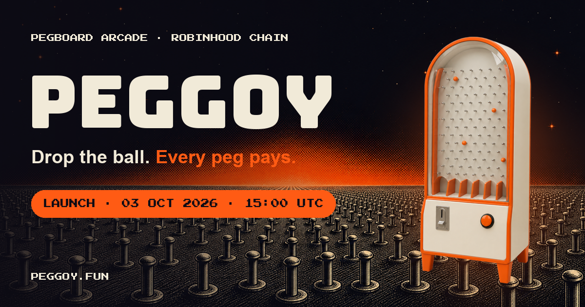

<div align="center">



### Drop the ball. Every peg pays.

**[peggoy.fun](https://peggoy.fun)** · **[X @peggoydotfun](https://x.com/peggoydotfun)** · **[Telegram](https://t.me/peggoydotfun)** · Robinhood Chain · $PEGGOY launches on Pons **03 Oct 2026 · 15:00 UTC**

</div>

---

## What is PEGGOY?

A pegboard arcade machine on Robinhood Chain.

| | |
|---|---|
| **Stake** | Stake $PEGGOY in the Machine. Withdraw anytime: no lock, no fee, no pause |
| **Balls** | `balls = stake × seconds`, booked per week on chain. Linear, so one wallet or a thousand earn the same |
| **Stream · 80%** | 80% of every wei of ETH that reaches the Machine streams to stakers pro rata over 7 days |
| **Drop · 20%** | 20% builds the weekly Drop, paid every Saturday 15:00 UTC to 14 winners drawn by balls (1×40%, 3×10%, 10×3%) |

No free-signature airdrop: free entries get farmed by design, so nothing is given for them.

## Fair by construction

| | |
|---|---|
| Sybil-neutral | Weights are linear in stake × time; splitting buys nothing |
| On chain | Every weight is a `Staked`/`Withdrawn` event; `ballsOf(user, week)` and `totalBalls(week)` are public views |
| Randomness | The first drand `evmnet` round after the week closes, BLS-verified on chain; 14 independent exponential races weighted by balls |
| Owner | 2-of-3 Safe behind a 48 h `TimelockController`; bounded parameters only, no path to stakes or streamed ETH |
| No dust tricks | `roll()` needs 0.01 ETH queued or the round over, so a 1-wei round can't hold real rewards back |
| No stuck ETH | An unreleased Drop pot rolls into the current week after 30 days, by anyone |

Full design and the gaps it closes: [`ARCHITECTURE.md`](ARCHITECTURE.md). Launch steps: [`LAUNCH.md`](LAUNCH.md).

## Contracts

| | Network | Address |
|---|---|---|
| `PeggoyMachine` (demo) | Robinhood testnet 46630 | `0x5B2eba6D854F898D59b5f77E7d923085e3475C2a` |
| `PeggoyDrop` (demo) | Robinhood testnet 46630 | `0x6e8e3162eAF5e74ea523985CA0AEA8baB6dd9331` |
| `TimelockController` (demo) | Robinhood testnet 46630 | `0xebA64E8187b941E538420f286BBAA9c1A927f984` |
| `DemoToken` tPEGGOY (faucet) | Robinhood testnet 46630 | `0xdf7edd050F0af2773C32F955857142995E084e64` |
| `PeggoyMachine` | Robinhood Chain 4663 | deployed before launch |

```bash
git clone --recurse-submodules https://github.com/peggoydotfun/peggoy.git
cd peggoy/contracts && forge test     # 41 tests: fuzzed solvency, balls accounting, real drand beacons, win-rate statistics
```

> [!IMPORTANT]
> Unaudited at launch. Caps and expectations stay small until an external audit.

## Site

Static HTML + ES modules, no build step: `three@0.170` (halftone-shaded Meshy models), GSAP + Lenis, a playable
practice pegboard, 8-bit WebAudio. Wallet: EIP-6963, no library. Reads go to a CORS-enabled public RPC, writes go
through your wallet. Strict CSP and `frame-ancestors 'none'` ([`deploy/nginx.conf`](deploy/nginx.conf)).

```bash
python3 -m http.server 5180    # http://localhost:5180
```

| File | |
|---|---|
| `index.html`, `main.js`, `board.js` | landing, 3D stage, practice board |
| `machine.html`, `machine.js` | the Machine: stake, withdraw, claim, exit, roll |
| `wallet.js`, `connect-ui.js`, `chain.js` | wallet connect, picker, chain reads/writes |
| `deployments.json` | addresses per network (`?net=testnet` keeps the demo reachable) |
| `contracts/` | Foundry: `PeggoyMachine`, tests, deploy scripts |

## Safety

PEGGOY never asks for a seed phrase and never DMs first. The only transactions are the ones you start on the
Machine page: approve, stake, withdraw, claim, exit, roll.
